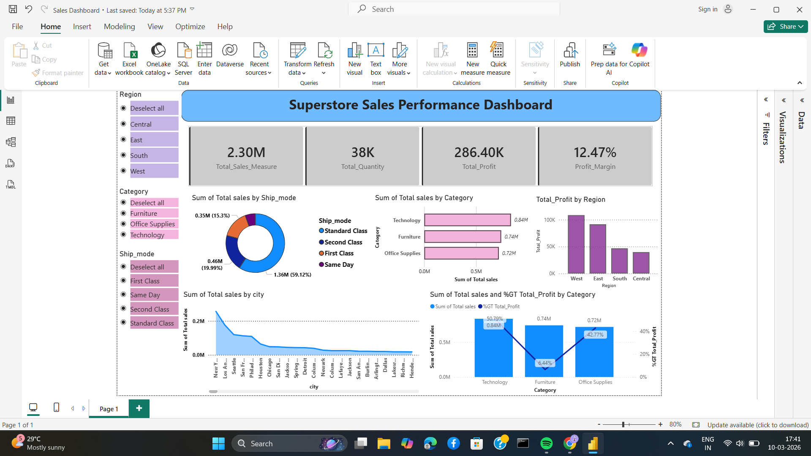

# Superstore Sales Performance Dashboard

This project presents an interactive **Power BI dashboard** created using the Superstore dataset to analyze sales performance, profit trends, and regional insights.

## Dashboard Preview

## Key KPIs
- Total Sales
- Total Quantity
- Total Profit
- Profit Margin %

## Visualizations Used
- Donut Chart → Sales by Ship Mode
- Bar Chart → Sales by Category
- Column Chart → Profit by Region
- Line Chart → Sales by City
- Line & Clustered Column Chart → Sales vs Profit % by Category

## Filters (Slicers)
- Region
- Category
- Ship Mode

These filters allow users to dynamically change the dashboard insights.

## Tools Used
- Power BI
- DAX
- Python (Google Colab)
- CSV Dataset

## Project Files
- `superstore_sales.csv` → dataset
- `data_analysis.ipynb` → data cleaning and analysis
- `superstore_dashboard.pbix` → Power BI dashboard
- `dashboard.png` → dashboard preview image

## Insights
- Technology category generates the highest sales.
- West region has the highest profit.
- Standard Class shipping contributes the most sales.
